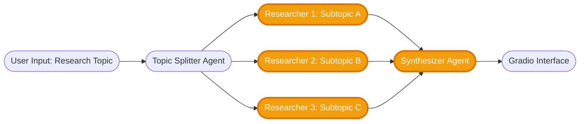

# 🔴 Advanced Track — ScholarAI

Welcome to the **Advanced Track** of the ScholarAI project!
This track is for participants ready to explore **multi-agent AI systems** that collaborate to perform deeper research synthesis.

You’ll build a **multi-agent research workflow** where several **Researcher Agents** independently search and summarize sub-topics, and a **Synthesizer Agent** combines their findings into a coherent literature summary.

At the end of this track, you will:

* Design and implement **specialized research agents** with unique responsibilities.
* Explore **multi-agent orchestration patterns** (parallel vs hierarchical).
* Learn **context sharing, role specialization, and reasoning coordination**.
* Deploy a **Gradio interface** that displays combined research findings interactively.

---

## Agent Workflow

---

## 🎓 Weekly Breakdown

### ✅ Week 1: Setup & Agent Foundations

* Create your repo, environment, and `requirements.txt`.
* Add a `.env` file with keys:
  `OPENAI_API_KEY`, `TAVILY_API_KEY` **or** `SERPAPI_API_KEY`.
* Build the **Topic Splitter Agent** using the **OpenAI Agents SDK**:

  * Takes a research topic and outputs 2–3 focused sub-topics.
* Implement **Researcher Agents**:

  * Each uses **Tavily or SerpAPI** to search for papers, articles, or reports.
  * Returns summarized findings for its subtopic (TL;DR, key insights, and citations).
* Test each agent independently.

---

### ✅ Week 2: Multi-Agent Orchestration

* Design the **orchestration pattern**:

  * The **Topic Splitter** spawns parallel **Researcher Agents**.
  * Once all researchers finish, results pass to a **Synthesizer Agent**.
* The **Synthesizer Agent** should:

  * Merge findings, highlight consensus and conflicting results,
  * Produce a final structured report:

    * **Executive Summary (≤150 words)**
    * **Key Insights by Subtopic**
    * **Conflicts or Gaps in Literature**
    * **Citations & Resource List**
* Experiment with **prompt chains** for better context passing.
* Optional: add a **“Critic Agent”** to review factual consistency.

---

### ✅ Week 3: Deployment

* Build a **Gradio UI** to showcase the complete multi-agent system:

  * Input: Main research topic.
  * Output tabs:

    * **Overall Summary**
    * **Per-Researcher Findings**
    * **Sources / Citations**
  * Buttons to **Download Markdown** or **JSON** report.
* Prompt tuning:

  * Add style controls (e.g., academic, business, layperson).
  * Improve synthesis coherence using self-critique loops.
* Deploy your app to **Hugging Face Spaces** or **Streamlit Cloud**.

---

## 🗒️ Project Timeline Overview

| Phase                      | General Activities                                                   |
| -------------------------- | -------------------------------------------------------------------- |
| **Week 1: Setup & Agents** | Topic Splitter, Researcher Agents, web search integration            |
| **Week 2: Orchestration**  | Multi-agent pipeline, Synthesizer Agent, structured synthesis output |
| **Week 3: Deployment**     | Gradio interface, prompt tuning, final deployment                    |

---

## 📃 Report Template

Use the [REPORT.md](./REPORT.md) to document:

* Agent roles and interactions,
* Example prompts and outputs,
* Notes on orchestration design,
* Screenshots of your working app,
* Reflections on coordination challenges and synthesis quality.

---

## 🚪 Where to Submit

Place your work in:

* `submissions/team-members/<your-name>/` (official team), or
* `submissions/community-contributions/<your-name>/` (open contributor).

Refer to the [CONTRIBUTING.md](../CONTRIBUTING.md) for full details.

---

Would you like me to also generate the **REPORT.md** template next (with weekly reflection questions tailored to the beginner and advanced scopes)? It will complete the project set.
